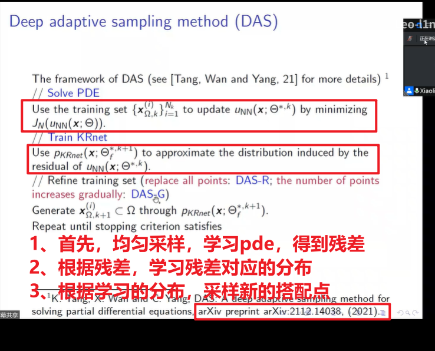
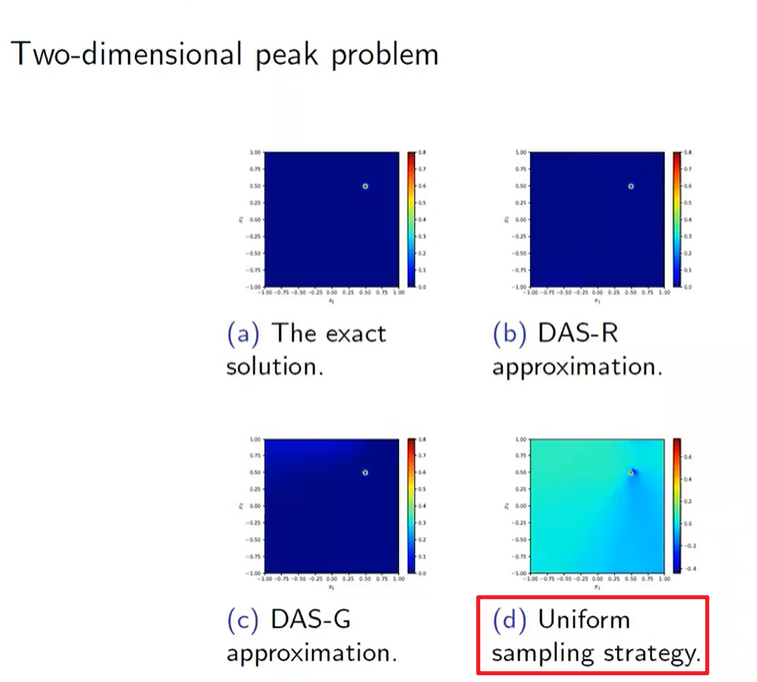
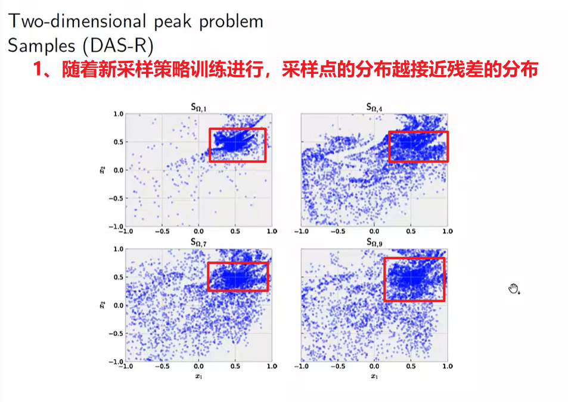
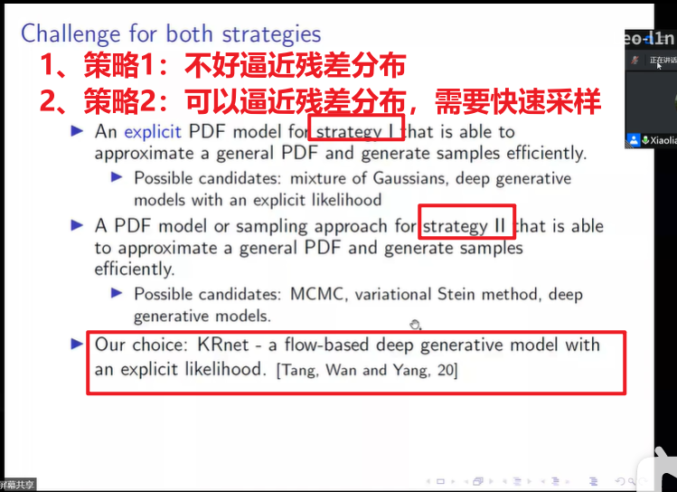
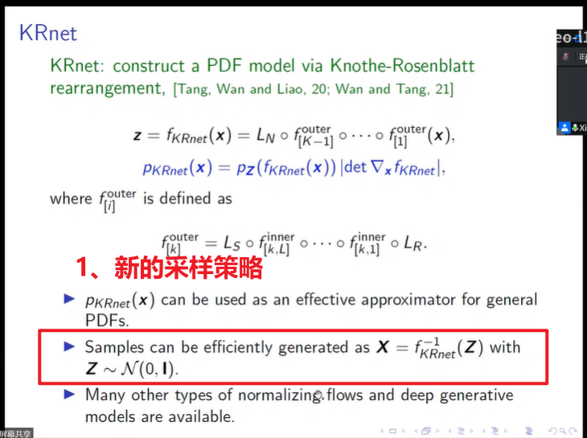

# GradientAdaptiveResamplingPINN

# 残差分布自适应采样

- [video1:Adaptive deep neural networks methods for high-dimensional partial differential equations](https://www.bilibili.com/video/BV1j3411K7GK/)
- [slides1:](http://www.tangkejun.com/projects.html)

<<<<<<< HEAD

=======

