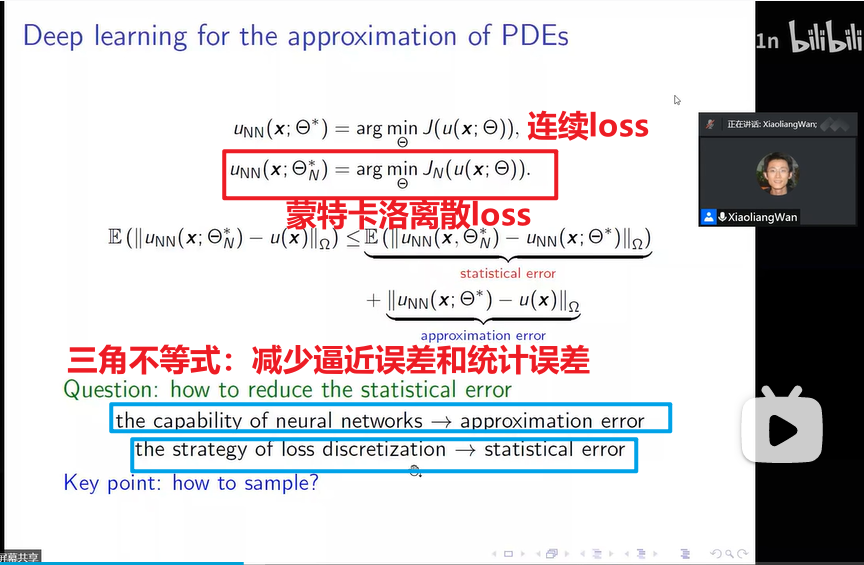
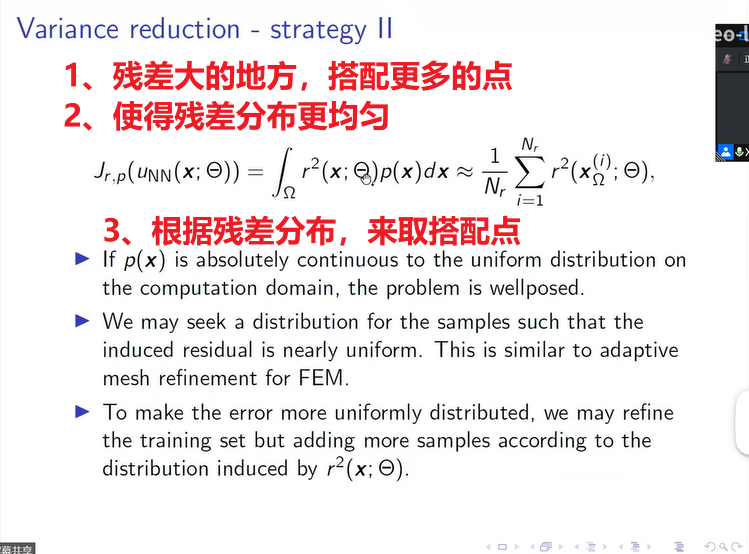

# GradientAdaptiveResamplingPINN
使用梯度来进行自适应采样PINN

- [video1:Adaptive deep neural networks methods for high-dimensional partial differential equations](https://www.bilibili.com/video/BV1j3411K7GK/)

